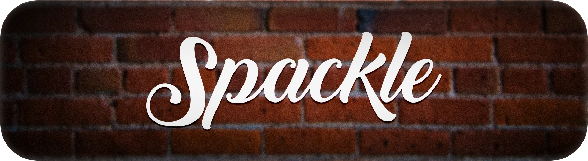
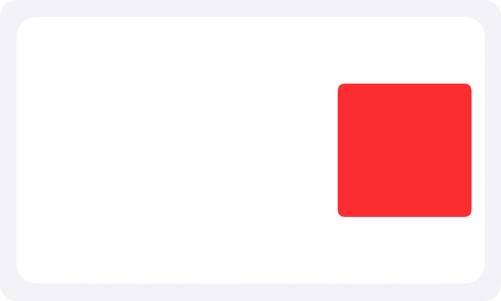

<span align="center">

[](http://cocoadocs.org/docsets/Spackle)
[](https://raw.githubusercontent.com/TimOliver/Spackle/main/LICENSE)
[](http://cocoadocs.org/docsets/Spackle)
    
</span>

Spackle is a framework with the mission of filling the gaps in UIKit when working with configuring and laying out `UIView` components. The framework features a collections of extensions for popular UIKit and Core Graphics components in order to make working with them much more streamlined and efficient.

While Auto Layout is officially recommended as the best way to lay out UI components in UIKit, it does have some downsides. When the rules and complexity of the layout become too high, performance can often take a hit. Likewise, when constraints break, debugging what went wrong can sometimes take a long time.

For this reason, sometimes manual frame layout is still the preferred method. However most of the time, it involves a lot of repetitive, hard-to-read math expressions. The goal of Spackle is to help automate away a lot of the repetitive aspects of these expressions, making manual layout easier to type, and easier to read, without introducing the same performance overhead of Auto Layout.

# Instructions

As a very simple use-case, consider how you would lay out this red view inside of its white container view. 


    
It would probably look something like this.

```swift
redView.frame.origin.x = containerView.frame.width - (redView.frame.width + 10)
redView.frame.origin.y = containerView.frame.midY - redView.bounds.midY
```

This is super performant and is simple enough to write, but it isn't very easy to read after the fact.

With Spackle, the equivalent code becomes this.

```swift
redView.rightCenter = containerView.bounds.rightCenter.offsetBy(x: -10)
```

By defining and using relative anchors, we can achieve a similar flexibility to Auto Layout, but in a much simpler way.

# Requirements
* Swift 5
* UIKit-compatible platforms (iOS, tvOS, Mac Catalyst)

# Installation

Spackle is a very simple framework and can be easily imported manually or with CocoaPods.

## Manual Installation

Drag the `Spackle` folder into your Xcode project.

### CocoaPods

```
pod 'Spackle'
```

### SPM

I'll add this eventually. But if you want it now, please file a PR!

# Credits

Spackle was built as a component of iComics 2 by [Tim Oliver](https://twitter.com/TimOliverAU)

# License

Spackle is available under the MIT License. Please check the [LICENSE](LICENSE) file for more information.
